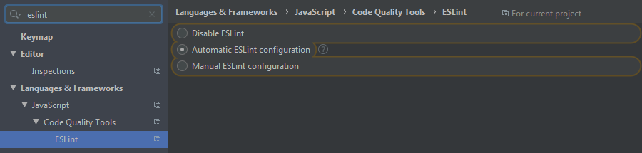
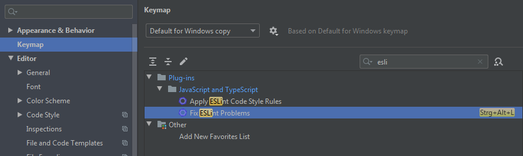
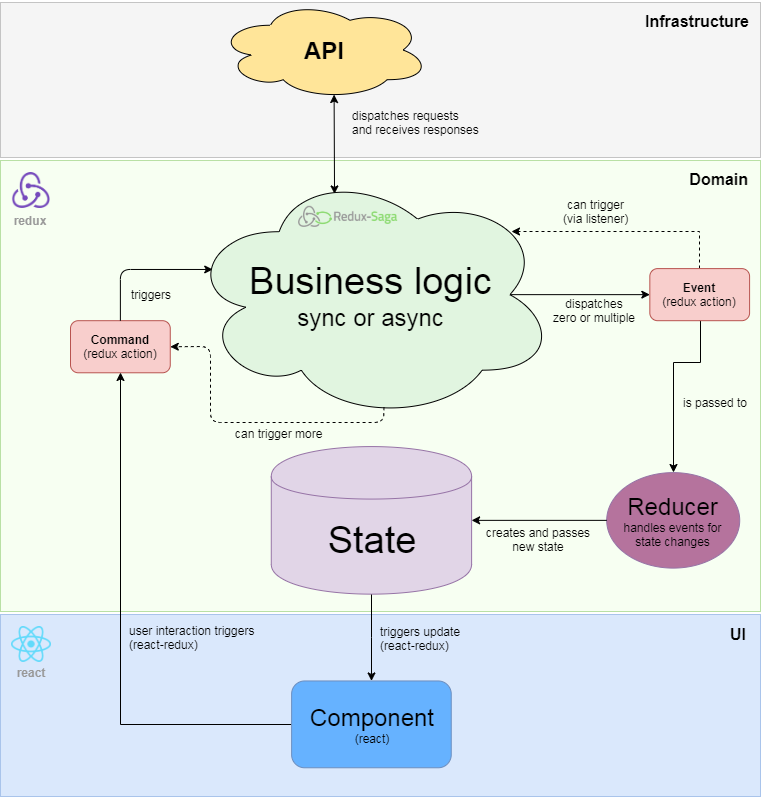

`test coverage is going to be improved in the next few days`

# React Redux Boilerplate (WIP)
Frontend boilerplate realized in [react](https://reactjs.org/) combined with [redux](http://redux.js.org/) and [redux-saga](http://redux-saga.js.org).
Written in [TypeScript](http://typescriptlang.org). Built with [webpack](http://webpack.js.org).

## Motivation
Sometimes it is hard to deliver good quality software due to economic time pressure.
With this project I try to provide a best practise frontend boilerplate to save nerves of developers
and other stakeholders.
   
## Installation
1. Install the latest version of [NodeJS](http://nodejs.org/en/download/)
2. Clone or download this repository
3. Open console and move into project folder
4. Run *npm install*
5. Configure eslint (optional, see "Configure eslint" section)
6. Follow the steps below to
   - either: serve the app for development mode (see "Development mode" section)
   - or: to build the app for production (see "Production mode" section)
7. Continuous integration (optional): Execute `npm run ci` to automatically test and build the app for every push on your project repository.
   
## Configure eslint
To prevent errors during continuous integration, I recommend configuring your IDE to support the given `.eslintrc.json`. 
If you don't know about eslint, you probably find the answer [here](https://eslint.org/).
However, below you can see the eslint configuration for [WebStorm](https://www.jetbrains.com/webstorm).

Automatic detection of `.eslintrc.json` in the project folder:

Replace `Strg + Alt + L` shortcut with eslint fix:

## Development mode
To run the app with hot module reloading at *//localhost:9000*, run:

    npm run start:spa

## Production mode
To build the app in the *dist* folder, run:

    npm run build:spa
    
## Open todos (WIP)
1. Finalization of authentication module
2. Test coverage
3. (Concurrent saga performance analysis)
4. (Usage of [react hooks](https://reactjs.org/docs/hooks-intro.html) instead of class components)
  
## Features
1. Basic [JWT](http://jwt.io) authentication:
    - with remember me flag
    - ideally the authentication server responds with the [jwtSecret]-httpOnly-cookie and [jwtHeader].[jwtPayload] in the response body, to be protected against XSS and CSRF attacks.
    - simulated with a mocked http request dispatcher in development mode
2. Toasts integration
    - multiple messages per toast
    - pipelined messages considering running toast animations (async visibility of toasts)
3. Bootstrap 4 SCSS and [material icons](http://material.io/resources/icons/) integration
4. Styling with [styled-components](http://styled-components.com/)
5. Request handling with [axios](http://npmjs.com/package/axios) library in the background
6. Loader integration according to running requests
7. UTC datetime handling with [moment](http://momentjs.com) in the background 
8. Basic form components
9. Prepared testing (see Testing section below)
10. Dynamic browser support. Have a look at [browsersl.ist](http://browsersl.ist/) and paste the content of `.browserslistrc`.
11. Linting with Airbnb presets

## Architecture
The target was to create a highly maintainable frontend boilerplate.
To be specific, the criteria was: readable code, flat learning curve, documentation, large community, easy testing.

So the architecture was divided in three layers:
1. **Domain Layer**: This is the source of truth layer. It holds your business logic, manages your app state, async action logic and side effects. Try to put in the most stuff in this layer to reuse it later. Never couple specific implementations (e.g. browser cookies or browser history) in this layer.
2. **Infrastructure Layer**: This is the layer where the specific implementations live in (e.g browser cookie storage for browser environments).
3. **UI Layer**: In this layer all web UI components live in.

One picture says more than thousand words:

By the way, if you strictly continue to separate these layers, this project could also be extended with an additional "NativeUI" layer
for mobile devices (e.g. with [react-native](https://reactnative.dev/)). Already written business logic then can be reused from the domain layer.
Below you find some articles which hopefully help you to understand the bird's eye view of the architecture:

- ["MVC vs Flux vs Redux – The Real Differences"](https://www.clariontech.com/blog/mvc-vs-flux-vs-redux-the-real-differences)
- ["Command vs. Event in Domain Driven Design"](https://medium.com/ingeniouslysimple/command-vs-event-in-domain-driven-design-be6c45be52a9)

### Evaluation: whys and whats
Redux was chosen because it makes modularity and maintainability a breeze while giving you full control over every action which is happening during the runtime of your frontend app.
It works like a charm with Domain Driven Design (DDD) by providing a pattern to encapsulate the view from the business logic with its general bus for actions (e.g. commands, events).

Nevertheless redux only handles synchronous data flow and therefore it was required to find a solution for sync and async business logic handling.
Most common redux libraries for this are [redux-thunk](https://www.npmjs.com/package/redux-thunk), [redux-saga](http://redux-saga.js.org) and [redux-observable](http://redux-observable.js.org).

[Redux-thunk](https://www.npmjs.com/package/redux-thunk) could be sorted out quite early:
The code gets really messy over time. Most people end up in a callback hell and therefore testing is also not that easy.
One would crawl through some articles or give it a try. No further discussion here about [redux-thunk](https://www.npmjs.com/package/redux-thunk).

The two favorites obviously were redux-saga and redux-observable.
Following comparison will give a hint why [redux-saga](http://redux-saga.js.org) was chosen over [redux-observable](http://redux-observable.js.org):

**redux-observable**:
- (+) easy testing (error prone if you don't know exactly what you are doing)
- (+) RxJs observable is a widespread technology
- (-) relatively hard to learn
- (+) documentation
- (+) no callback hell

**redux-saga**:
- (+) easy-testing
- (+) flat learning curve
- (+) large community
- (+) documentation
- (+) no callback hell
- (+) more control with yield over async await

**own redux middleware**:
- (+) full control 
- (-) head around testing and probably mocking everything
- (-) error prone
- (-) no community, no documentation

Read a [good article](https://shift.infinite.red/redux-observable-epics-vs-redux-sagas-8e53610c0eda)
about this and understand saga's [flow principle](https://redux-saga.js.org/docs/advanced/NonBlockingCalls.html).
But keep in mind: Whenever you apply the saga's flow principle, time travelling with an injected
redux state could get tricky. Imagine, with the "login flow" example before, the current user is already given in the injected state,
then saga is not listening for a "logout" action yet.

## Testing
The integrated test runner is [jest](http://jestjs.io).
Business logic (redux-saga) is tested with [redux-saga-test-plan](https://www.npmjs.com/package/redux-saga-test-plan).
React components are tested with [enzyme](https://enzymejs.github.io/enzyme/).

To execute the tests, run:

    npm run test

Tests are organized as follow:
- The file suffix `.test.ts` is required
- A unit test is placed next to the tested file. As an example the unit test for `foo/bar/baz.ts` is `/foo/bar/baz.unit.test.ts`.
- A integration test for encapsulated module behaviour (e.g. toaster), is placed inside the module folder. As an example `/src/Common/Domain/Toaster/Saga/Callables/ShowMessageHandling.integration.test.ts`.
- Integration tests for behaviour over multiple modules should be placed in the `tests` directory (e.g. `[rootDir]/tests/Common/Foo/Bar.integration.test.ts`).

As you can see, unit tests always have the suffix `.unit.test.ts`, integration tests the suffix `.integration.test.ts`.
Read another [smart article](https://medium.com/@JeffLombardJr/organizing-tests-in-jest-17fc431ff850) about testing structure.

I think, because snapshot tests are expected to fail with every UI change, they are completely useless for TDD.
In my opinion, tests are here to develop faster and especially to prevent unwanted bugs.
Similar thoughts [here](https://medium.com/@tomgold_48918/why-i-stopped-using-snapshot-testing-with-jest-3279fe41ffb2).

## Appreciation
Many thanks to the awesome [Dan Abramov](http://github.com/gaearon), for redux and the [ingeniously great redux video tutorial](https://egghead.io/courses/getting-started-with-redux).
