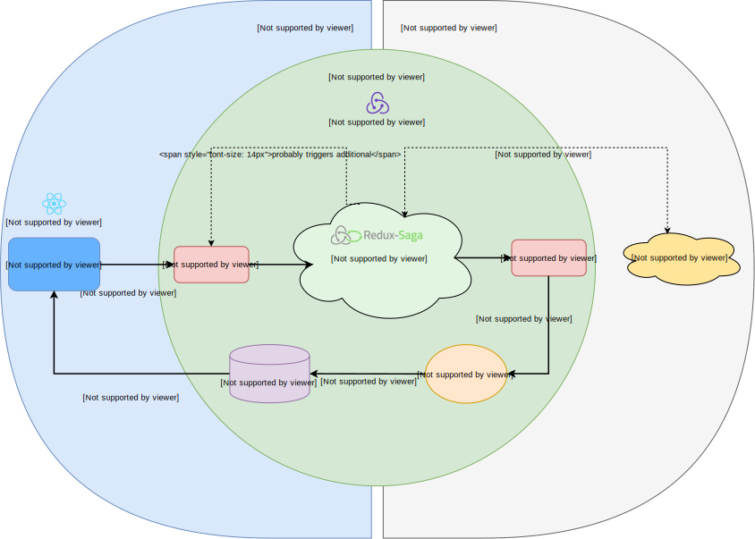

[« docs overview](../README.md)

# Architecture
The codebase is divided in three layers.
1. `ui` - In this layer all react or other ui components live in
2. `domain` - This is the source of truth layer: it holds your business logic, manages your app state, async action logic and side effects. Try to put in the most stuff in this layer to reuse it later.
3. `infrastructure` - This is the layer where non ui but too specific implementations live in: e.g. local or session storage functionality for browser environments.

With this separation of concerns it is possible to reuse domain logic and to create encapsulated tests.
Domain logic could - for instance - be reused in native mobile app components.

The graphic below shows the mentioned three layers,
their contents and some layer connecting library functions.
Imagine an onion in which the outer shell is dependent on the inner one.

## Structure
The project is structured as a monorepo with `packages`, `web-app`
and `mobile-app` as sub repositories, manageable by [lerna](https://lerna.js.org/).

#### What's a  `module`?
- A so called `module` is divided in the three layers by `ui`, `domain` and `infrastructure` folders.
- Every layer folder should only be present if it contains code.
- Every layer folder must have a `index.ts(x)` file to define its public api (ensured by eslint rules).
- A `module` always is the leaf of a subdirectory structure and must not contain other modules (partially ensured by eslint rules).
- A module can have dependencies to other modules.

With this feature based structure, modules easily can be moved in the codebase.

## Appendix
Following information is not necessary to know but may be interesting for you.

First of all it's probably good to have a clue about the evolution of frontend architectures,
explained by a sweet article:
["MVC vs Flux vs Redux – The Real Differences"](https://www.clariontech.com/blog/mvc-vs-flux-vs-redux-the-real-differences).

### Why redux?
Redux was chosen because it makes modularity and maintainability a breeze
while giving you full control over every action which is happening during the runtime
of your frontend app.
With its general bus for actions, redux provides a way to encapsulate view from state changes.

### Why redux-saga?
Redux only handles synchronous data flow.
Therefore it was required to find a solution for handling async (and sync) logic.
Most common redux libraries for this are [redux-thunk](https://www.npmjs.com/package/redux-thunk),
[redux-saga](http://redux-saga.js.org) and [redux-observable](http://redux-observable.js.org).

[Redux-thunk](https://www.npmjs.com/package/redux-thunk) was sorted out quite early:
Code could easily get messy over time.
Coding goes on with the familiar and known callback hell.
Code used with [redux-thunk](https://www.npmjs.com/package/redux-thunk)
mostly therefore is strongly coupled so it is hard to write encapsulated tests.

The two favorites obviously were [redux-saga](http://redux-saga.js.org) and [redux-observable](http://redux-observable.js.org).
Following comparison will give a hint why [redux-saga](http://redux-saga.js.org) was chosen over [redux-observable](http://redux-observable.js.org):

**redux-observable**:
- (+) easy testing (error prone if you don't know exactly what you are doing)
- (+) RxJs observable is a widespread technology
- (-) relatively hard to learn
- (+) documentation
- (+) no callback hell

**redux-saga**:
- (+) easy-testing
- (+) flat learning curve
- (+) large community
- (+) documentation
- (+) no callback hell
- (+) more control with yield over async await

**own redux middleware**:
- (+) full control 
- (-) head around testing and probably mocking everything
- (-) error prone
- (-) no community, no documentation

Read a [good article](https://shift.infinite.red/redux-observable-epics-vs-redux-sagas-8e53610c0eda)
about the comparison between these two. After that you probably want to understand [saga's flow principle](https://redux-saga.js.org/docs/advanced/NonBlockingCalls.html),
which could be really helpful to write readable and especially less code.
