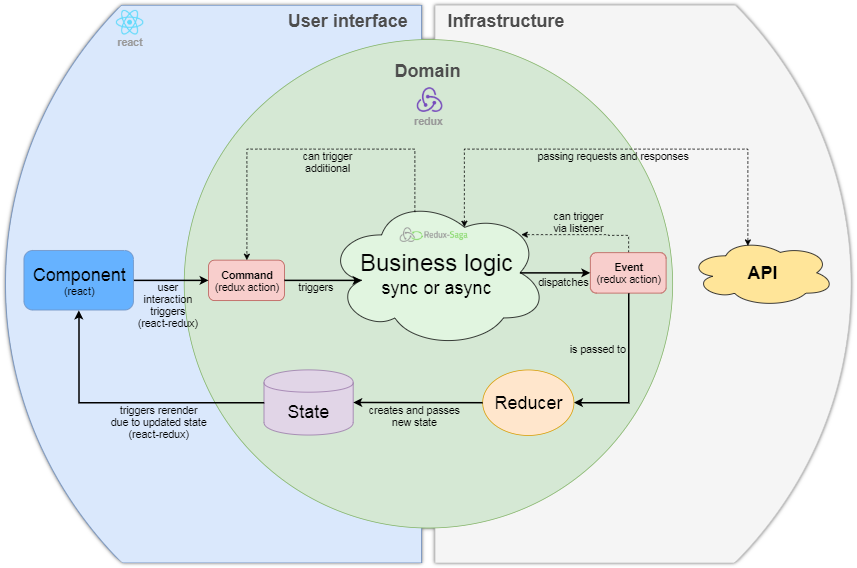

[« docs overview](../README.md)

# Architecture
Target was to create a highly maintainable frontend boilerplate.
To be specific, the criteria were: reusable codebase, readable code, flat learning curve, documentation, large community, easy testing.
Following explanations should clarify the architecture.

## Layers
The codebase is divided in three layers:
1. **Domain Layer**: This is the source of truth layer. It holds your business logic, manages your app state, async action logic and side effects. Try to put in the most stuff in this layer to reuse it later. Never couple specific implementations (e.g. browser cookies or browser history) in this layer.
2. **Infrastructure Layer**: This is the layer where the specific implementations live in (e.g browser cookie storage for browser environments).
3. **UI Layer**: In this layer all web UI components live in (recognizable as `Native` and `Web` folders in Packages).

With the separation of these layers it is guaranteed that already written business logic can be used for multiple views (e.g. web and native).

For a better understanding have a look at the info graphic below. The relevant technologies are listed as well.

## Structure
Generally the project is structured as a monorepo with several sub projects inside.
Following definitions are given:

- `Package:` A package is a collection of `ModuleCollections`.
- `ModuleCollection:` A module collection contains multiple modules (e.g. `Packages/Entity`, `Packages/Common`)
- `Module:` A module contains strongly coupled features:
    - Every module is divided in `domain`, `infrastructure` and `ui` (divided in `native` and `web`) layer.
    - In each of these layers an `index.ts` file lives in, to define its public api.
    - A module should contain sub modules in a `sub-modules` directory.
    These sub modules should only be imported from the module itself.

With this feature based structure, it is ensured that specific features easily can be moved up and down in the codebase.

## Appendix
Following information is not necessary to know but may be interesting for you.

### Why redux?
Redux was chosen because it makes modularity and maintainability a breeze while giving you full control over every action which is happening during the runtime of your frontend app.
It works like a charm with Domain Driven Design (DDD) by providing a pattern to encapsulate the view from the business logic with its general bus for actions (e.g. commands, events).

Additional readings:
- The evolution of frontend architectures: ["MVC vs Flux vs Redux – The Real Differences"](https://www.clariontech.com/blog/mvc-vs-flux-vs-redux-the-real-differences)
- ["Command vs. Event in Domain Driven Design"](https://medium.com/ingeniouslysimple/command-vs-event-in-domain-driven-design-be6c45be52a9)

### Why redux-saga?
Redux only handles synchronous data flow and therefore it was required to find a solution for handling sync and async business logic.
Most common redux libraries for this are [redux-thunk](https://www.npmjs.com/package/redux-thunk), [redux-saga](http://redux-saga.js.org) and [redux-observable](http://redux-observable.js.org).

[Redux-thunk](https://www.npmjs.com/package/redux-thunk) could be sorted out quite early:
The code gets really messy over time. Most people end up in a callback hell and therefore testing is also not that easy.
One would crawl through some articles or give it a try. No further discussion here about [redux-thunk](https://www.npmjs.com/package/redux-thunk).

The two favorites obviously were redux-saga and redux-observable.
Following comparison will give a hint why [redux-saga](http://redux-saga.js.org) was chosen over [redux-observable](http://redux-observable.js.org):

**redux-observable**:
- (+) easy testing (error prone if you don't know exactly what you are doing)
- (+) RxJs observable is a widespread technology
- (-) relatively hard to learn
- (+) documentation
- (+) no callback hell

**redux-saga**:
- (+) easy-testing
- (+) flat learning curve
- (+) large community
- (+) documentation
- (+) no callback hell
- (+) more control with yield over async await

**own redux middleware**:
- (+) full control 
- (-) head around testing and probably mocking everything
- (-) error prone
- (-) no community, no documentation

Read a [good article](https://shift.infinite.red/redux-observable-epics-vs-redux-sagas-8e53610c0eda)
about this and understand saga's [flow principle](https://redux-saga.js.org/docs/advanced/NonBlockingCalls.html).
But keep in mind: Whenever you apply saga's flow principle, time travelling with an injected
redux state could get tricky. With the previous "login flow" example, imagine the current user is already given in the injected state
and the saga is not listening for a "logout" action yet.
